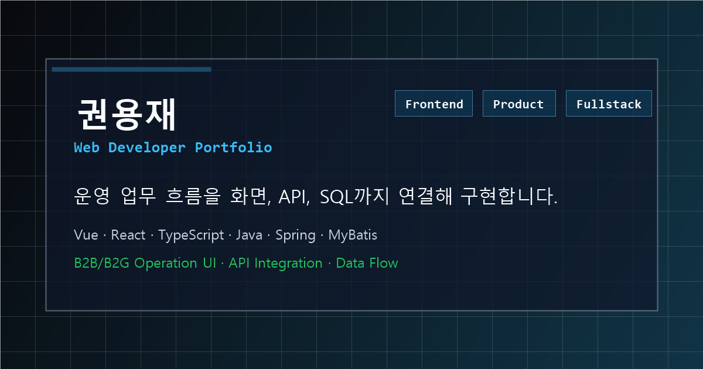
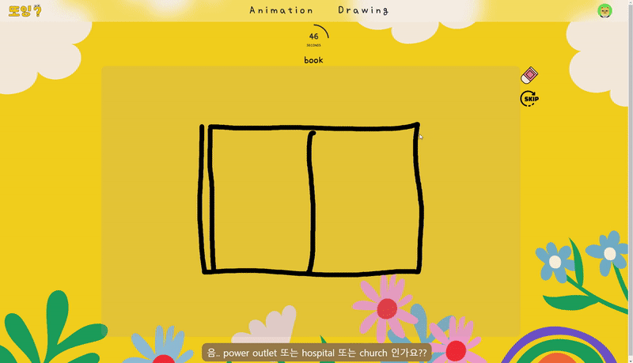
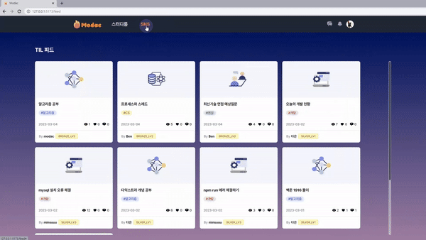
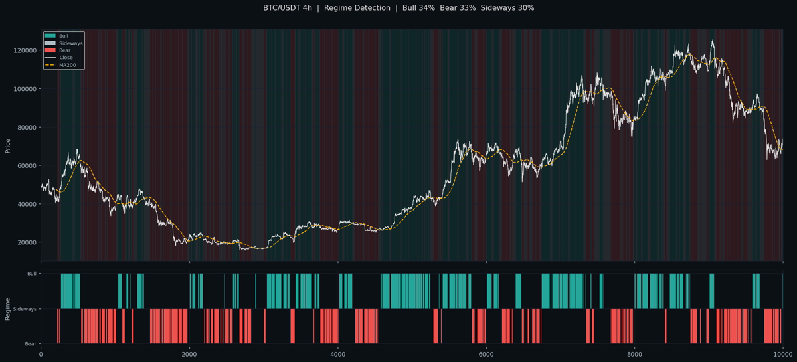
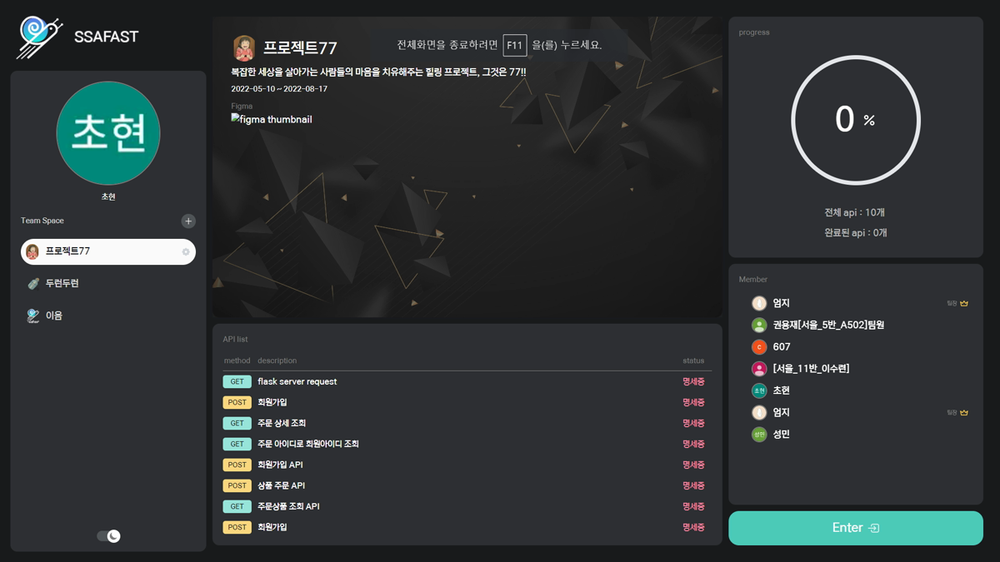

# Yongjae Kwon Portfolio

<p align="center">
  
  
  
  
</p>

운영 시스템과 관리자 도구 경험을 역할 관점별로 보여주는 Vue 3 + TypeScript + Vite 포트폴리오입니다.

> B2B/B2G 운영 UI, API 연동, 권한/상태 기반 조회, SQL 흐름을 함께 이해하는 웹 개발자 포트폴리오

운영 중인 B2B·B2G 시스템에서 쌓은 관리자 화면 개발, REST API 연동, Vue.js 화면 개발, 권한·조회 조건 처리, MyBatis SQL 점검, 메일·파일·인증 연동 경험을 Frontend, API & Data, Fullstack 관점으로 정리했습니다. 개인·팀 프로젝트에서는 React, TypeScript, Next.js, Redux, Zustand, React Query, Canvas, FastAPI, WebSocket, Docker Compose를 활용해 실시간 데이터 대시보드, 개발자 도구형 UI, AI 연동 학습 화면을 만들었습니다.

## Quick Links

| Link | URL |
| --- | --- |
| Live Portfolio | [portfolio-six-inky-14.vercel.app](https://portfolio-six-inky-14.vercel.app/) |
| Frontend Resume | [resume.pdf](https://portfolio-six-inky-14.vercel.app/resume.pdf) |
| API & Data Resume | [resume-api-data.pdf](https://portfolio-six-inky-14.vercel.app/resume-api-data.pdf) |
| Fullstack Resume | [resume-fullstack.pdf](https://portfolio-six-inky-14.vercel.app/resume-fullstack.pdf) |

## Recruiter Snapshot

| Item | Detail |
| --- | --- |
| Positioning | 운영자가 반복해서 쓰는 업무 흐름을 화면, API, SQL, 외부 연동까지 연결해 구현합니다. |
| Core Stack | Vue, React, TypeScript, Java, Spring Boot, Spring MVC, MyBatis, MariaDB, Oracle |
| Best-fit Roles | Frontend Developer, API & Data Web Developer, Fullstack Web Developer |
| Project Signals | 실무 운영 시스템 4개, OSS/개인 프로젝트 4개, 역할별 이력서 3종 |
| Privacy | 배포 사이트와 PDF 이력서는 직접 링크용으로 공개하되, 검색 노출을 막기 위해 `noindex` 헤더를 적용했습니다. |

## Preview



## Project Visuals

| ddoing | MODAC |
| --- | --- |
|  |  |

| quant-core | SSAFAST |
| --- | --- |
|  |  |

## Design Direction

현재 UI는 `platform dashboard`를 컨셉으로 구성했습니다. 일반적인 포트폴리오보다 운영 콘솔, 관리자 도구, 데이터 대시보드에 가까운 인상을 주기 위해 다음 기준을 적용했습니다.

- 다크/라이트 모드 지원
- 그리드 배경과 콘솔형 카드로 플랫폼/운영툴 분위기 표현
- 단일 액센트 철학 — cyan은 CTA 버튼과 활성 내비게이션에만 사용, 나머지는 white-opacity 계열 뉴트럴
- 프로젝트를 단순 카드 나열이 아니라 case study 패널로 구성
- 기술스택과 직무 적합성 영역에 아이콘과 칩 UI 적용
- 커서 spotlight, 스크롤 reveal 애니메이션, 타이핑 효과로 생동감 부여
- 모바일 화면에서 버튼, 카드, 텍스트가 좁은 폭에서도 읽히도록 반응형 구성

## Positioning

**업무 흐름을 잘 이해하는 웹 개발자**

- 운영자가 반복해서 쓰는 관리자 화면과 업무 단계형 화면 개발 경험
- 등록, 업로드, 발송, 조회, 이력 확인이 이어지는 업무 흐름 구현 경험
- Vue.js, WebSquare, JSP, Nexacro 기반 실무 화면 개발 경험
- REST API, 인증, 메일, 파일, 알림 발송 결과와 화면 상태 연결 경험
- 권한, 조직, 기간, 상태값에 따른 조회 조건과 MyBatis SQL 흐름 이해
- React / TypeScript / Next.js 기반 실시간 데이터 대시보드와 개발자 도구형 UI 경험

## Application Tracks

하나의 배포 사이트 안에서 지원 방향에 맞는 내용을 보여주기 위해 `track` 쿼리 파라미터를 사용합니다.

| 지원 방향 | URL | 이력서 |
| --- | --- | --- |
| Frontend | `/` | `public/resume.pdf` |
| API & Data Web Developer | `/?track=api-data` | `public/resume-api-data.pdf` |
| Fullstack Web Developer | `/?track=fullstack` | `public/resume-fullstack.pdf` |

지원 목적에 따라 Frontend, API & Data, Fullstack 관점으로 같은 경험을 다르게 탐색할 수 있습니다. 개별 공고 분석 메모는 로컬 또는 비공개 문서로 관리합니다.

## Featured Projects

### TGS 협력사 포탈 시스템 (PPS)

Vue.js 기반 관리자 화면과 Spring Boot API를 연동해 협력사 교육 운영, CE 현황, 공지/설문/댓글, 인증 예외 처리 기능을 개발했습니다.

- 교육 등록, 대상자 엑셀 업로드, 메일 발송, 제출 현황 조회 흐름 구현
- 게시판·제안하기·설문에서 쓰이는 댓글·대댓글 UI와 처리 흐름 공통화
- CE 현황 메일 발송, 발송 이력 저장, 검증 상태별 조회 조건 개선
- Google OTP 2단계 인증, IP 기반 인증 예외, 공지 읽음 이력 처리 개선
- MariaDB / Oracle 기반 데이터 조회 및 통계 SQL 작성

### TSMS / IDCMS AS 업무 시스템

데스크톱, 모바일, 태블릿에서 이어지는 AS 접수·상담·동의·서명 업무 화면을 개발했습니다.

- WebSquare / JSP 기반 화면 신규 개발 및 운영 오류 수정
- AS 접수·이관·배정, 진행상태 조회, 모바일 접수 화면 개선
- 개인정보 동의, QR 확인, 무인보관함 접수, 태블릿 전자서명 흐름 구현
- 배송 일정, 학생 일괄 처리, 라벨/엑셀, 파일 조회·업로드 화면 개선
- 알림톡·BizTalk·메일 발송 결과와 권한별 조회 조건을 화면 상태로 반영

### 교육청 IT 자산관리 솔루션

교육청과 학교의 IT 자산을 등록, 현황 조회, 상태 관리, 이력 확인, 대시보드 집계로 관리하는 업무 화면을 개발했습니다.

- 자산 대시보드, 자산현황, 유상처리 현황 화면 개발 및 개선
- 교육청·학교·부서 권한에 따른 데이터 조회 범위와 검색 조건 반영
- 사업 차수, 기관, 자산 상태 기준의 집계와 목록 조회 SQL 개선
- 배치 이력, 메뉴 개편, 숫자·일자 포맷 등 운영 이슈 대응

### SR30 물류관리시스템

Nexacro와 Spring MVC 기반 물류·서비스 운영 시스템에서 일정, 설문, 재고, 리포트, KPI, 이력 조회 화면을 개선했습니다.

- 일정 공유, 근무 일정, 서비스 리포트, KPI 조회 화면 개선
- 설문 등록·응답·통계, 운영 설문 데이터 수집 흐름 구현
- 물류·재고·자재·입출고 및 설치/철거 리포트 화면 개선
- 개인정보 다운로드, 데이터 삭제, 접근 이력 등 관리자 이력 조회 기능 대응

### 또잉 영어 학습 서비스 (ddoing)

영어가 어려운 아이들을 위한 애니메이션 shadowing 및 Drawing 기반 영어 학습 서비스입니다. PM 역할과 함께 React/TypeScript 기반 Main Page, Drawing Page, AI 추론 API 연동 흐름을 담당했습니다.

- Canvas 입력, 타이머, 정답·오답·패스, 게임 완료 화면 흐름 구현
- 분류 모델 추론 결과를 Drawing Page에 연결해 사용자 그림을 게임 상태로 반영
- Drawing 결과 저장, 점수 요청, 경험치 반영, Hall of Fame 화면 개선
- AI 학습 데이터 전처리와 프론트엔드 연동 범위 조율
- GitHub author 필터 기준 개인 커밋 61건 규모의 화면 구현 및 기능 개선 참여

### Quant Core

시장 데이터 수집, 전략 백테스트, 실거래 실행 구조를 학습하기 위해 진행 중인 개인 프로젝트입니다. FastAPI 백엔드와 React/TypeScript 대시보드를 6개 컨테이너로 분리해 서비스 구조를 익히고 있습니다.

- JWT 인증과 Redis 블랙리스트 기반 로그아웃, IP별 로그인 실패 제한 구현
- WebSocket으로 포지션·체결 결과를 프론트에 실시간 브로드캐스트
- Walk-Forward 검증과 백테스트 실행 화면 구현, 실거래 정산은 수수료·펀딩비 포함 net PnL 기록
- PostgreSQL·Redis·API·UI·Collector·Backup의 6개 컨테이너 Docker Compose 구성

### SSAFAST

Figma, API 명세, 요청 테스트, 유스케이스 테스트, 성능 테스트를 한 공간에서 연결한 SSAFY 팀 프로젝트입니다.

- Next.js / TypeScript 기반 성능 테스트 UI 전체 구현
- BaseURL 소유권 인증 가드와 다중 URL 인증 코드 검증 화면 구현
- React Hook Form 기반 중첩 DTO 입력, 요청 파라미터 조립, 상태 동기화 처리
- ReactDOM.createPortal 기반 공통 Modal로 SSR 안전성과 z-index 충돌 해결
- SSAFY 2학기 심화 프로젝트 우수상 수상

## Additional SSAFY Projects

### MODAC

개발자를 위한 학습 내용 기록 및 공유 플랫폼입니다. Vue 3와 Pinia 기반 프론트엔드에서 학습방, Feed, Markdown 학습일지, GitHub commit 연동, 실시간 room 기능 일부를 구현했습니다.

- Vue 3 / Vite / Pinia 기반 화면과 상태 관리 구현
- 공개방·비공개방 입장, 학습방 설정, 퇴장, 참여자 상태 흐름 개선
- WebSocket 기반 group chat, room store, subscription 흐름 구현
- Feed, article, like, follow, 알림, mypage 등 학습 기록 공유 화면 개선
- GitHub author 필터 기준 개인 커밋 74건 규모의 화면 구현 및 기능 개선 참여

## Tech Stack

### Frontend

HTML5, CSS3, SASS/SCSS, JavaScript, TypeScript, Vue.js, React, Next.js, Zustand, Pinia, Redux, React Query, React Hook Form, Canvas, JSP, WebSquare, Nexacro, jQuery

### Backend

Java, Spring Boot, Spring MVC, Spring Security, MyBatis, FastAPI, Python, REST API, JWT, WebSocket

### Database

MariaDB, Oracle, PostgreSQL, Redis, SQLite, PL/SQL

### Tools

Git, SVN, Maven, Gradle, Docker, Docker Compose, Nginx, Node.js, Vite, TailwindCSS, Chart.js, Tabulator, Figma 시안 확인, Photoshop 시안 확인

## Project Structure

```text
src/
  components/        공통 UI 컴포넌트
  data/portfolio.ts  포트폴리오 프로필, 프로젝트, 기술 데이터
  views/             섹션 단위 화면
docs/
  frontend-resume-submit.md  제출용 간결 이력서
  frontend-resume-api-data.md API & Data 이력서
  frontend-resume-fullstack.md Fullstack용 이력서
```

## Getting Started

```bash
npm install
npm run dev
```

## Build

```bash
npm run build
```

## Deployment

Vite 기반 정적 사이트이므로 Vercel 또는 Netlify에 배포할 수 있습니다.

- Build command: `npm run build`
- Output directory: `dist`
- Node version: 20 이상 권장

## Resume

제출용 이력서 초안은 [docs/frontend-resume-submit.md](docs/frontend-resume-submit.md)에 정리되어 있습니다. 역할 관점별 이력서 초안을 함께 관리합니다.
