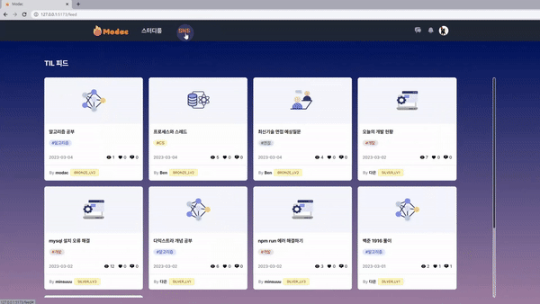

# portfolio

개인 포트폴리오 사이트입니다. 템플릿을 쓰지 않고 Vue 3 + TypeScript + Vite로 처음부터 만들었습니다.

- 사이트: https://www.yongjaekwon.com/
- 이력서 PDF: https://www.yongjaekwon.com/resume.pdf

채용 제출용 직접 링크로만 운영하고 있어서 검색 노출은 robots.txt로 막아 두었습니다.


## 어떤 내용을 담았나

운영 중인 B2B·공공 업무 시스템에서 화면부터 API·SQL·배포까지 이어서 개발한 경험을 담았습니다. 직무 탭에서는 Frontend와 Backend에서 맡은 부분을 나눠 볼 수 있고, 상세 화면에서는 문제와 제약, 선택 이유, 구현과 확인된 변화를 함께 설명합니다.

실무 시스템 두 개를 주요 프로젝트로 담았습니다.

- **PPS (B2B 협력사 포털)** — 대량 파일의 비동기 처리, Vue 화면 상태 분리, 본사 계정 발급 절차, 알림 정책과 Jenkins 배포 순서를 정리했습니다.
- **TSMS (교육용 단말 운영 시스템)** — 외부 API 호출 공통화, 중고거래 모니터링, 대량 단말 검증·QR 발급과 현장 점검·재점검 업무를 개발했습니다.

개인·팀 프로젝트에는 SSAFAST, 또잉, MODAC과 현재 재설계 중인 ReachRich를 담았습니다. 공개 가능한 팀 프로젝트는 GitHub 코드를 연결하고, 비공개인 ReachRich는 구조를 선택한 이유와 데이터 수집·React 화면·운영 자동화의 검증 근거를 상세 사례로 설명합니다.

프로젝트별 상세 사례를 제공하고, 일부 사례에는 공개 가능한 코드 예시를 함께 담았습니다. 상세 내용은 상세보기를 열 때 별도 청크로 불러옵니다. 실제 사내 코드와 화면, 고객사 정보, 개인 계좌·전략 데이터는 공개하지 않습니다.

SSAFAST, 또잉, MODAC 상세보기에는 당시 담당한 화면과 기능 흐름을 포트폴리오용으로 재구성한 인터랙티브 데모를 함께 제공합니다. API 명세·예시 성능 결과, Canvas 드로잉·타이머, 스터디룸 입장·채팅 흐름을 샘플 데이터로 직접 조작할 수 있으며 각 데모는 실행 버튼을 누를 때만 불러옵니다.

| ddoing | MODAC |
| --- | --- |
|  |  |

## 제출용 정리 방향

현재 사이트는 채용 제출용으로 한 가지 디자인만 보이도록 했습니다. 여러 디자인 실험보다 내용의 신뢰도와 읽는 순서를 우선합니다.

- 주요 프로젝트 안에서는 실무 경험을 중심으로 두고, 팀·개인 프로젝트는 보조 경험으로 배치했습니다.
- 기술명은 많이 나열하기보다 각 프로젝트에서 실제로 만든 기능을 중심으로 보이도록 줄였습니다.
- “성과처럼 보이는 숫자”보다 어떤 방식으로 문제를 재현하고 맞췄는지 설명하는 문장을 우선했습니다.
- 배치, 배포, 운영 확인 경험은 직접 수행한 범위 안에서만 짧게 설명했습니다.
- 디자인 전환 버튼은 제출 화면에서 숨기고, Fresh UI Kit 기반 대표 디자인으로 고정했습니다.
- 최신 대표 디자인은 `src/ui-kit`의 Fresh UI Kit을 사용합니다. 밝은 배경, 파란 CTA, 둥근 카드, 메쉬 그라디언트를 재사용 가능한 CSS 유틸리티로 분리했습니다.

자세한 사용법은 [docs/ui-kit.md](docs/ui-kit.md)에 있습니다.

## 구조

```text
src/
  components/          Navbar, Footer, 공통 모달 등 UI 컴포넌트
    demos/              개인·팀 프로젝트의 샘플 데이터 인터랙티브 데모
  composables/         useSkin, useProjectFilter 등 공통 상태 훅
  data/portfolio.ts    프로필·프로젝트·기술 데이터 (내용 수정은 대부분 이 파일)
  data/caseStudies.ts  프로젝트별 상세 사례와 공개 가능한 코드 예시
  views/               Home / Experience / Projects / TechStack / Education / Contact 섹션
public/
  resume.pdf           공개 이력서
docs/
  case-studies/        공개용 프로젝트 메모 (현재 화면 렌더링에는 직접 사용하지 않음)
  resume-general.html  이력서 HTML 원본
scripts/
  generate-resumes.mjs HTML → PDF 변환 스크립트
```

라우터 없이 App.vue가 섹션 뷰를 이어 붙이는 단일 페이지 구성입니다. 상세 사례 컴포넌트와 데이터는 프로젝트 모달을 열 때 동적으로 불러옵니다.

## 실행

```bash
npm install
npm run dev
```

빌드는 `npm run build`. vue-tsc 타입 체크가 먼저 돌고 Vite 빌드가 이어집니다.

## 이력서 PDF 만들기

이력서 원본은 `docs/resume-general.html`입니다. 수정한 뒤 아래 명령으로 `public/resume.pdf`를 다시 만듭니다.

```bash
npm run resumes:pdf
```

사이트와 이력서를 한 레포에서 관리하니 둘의 문구가 어긋나는 일을 줄일 수 있습니다.

## 배포

Vercel에 올려져 있습니다. 정적 사이트라 특별한 설정은 없습니다.

- Build command: `npm run build`
- Output directory: `dist`
- Node 20 이상
