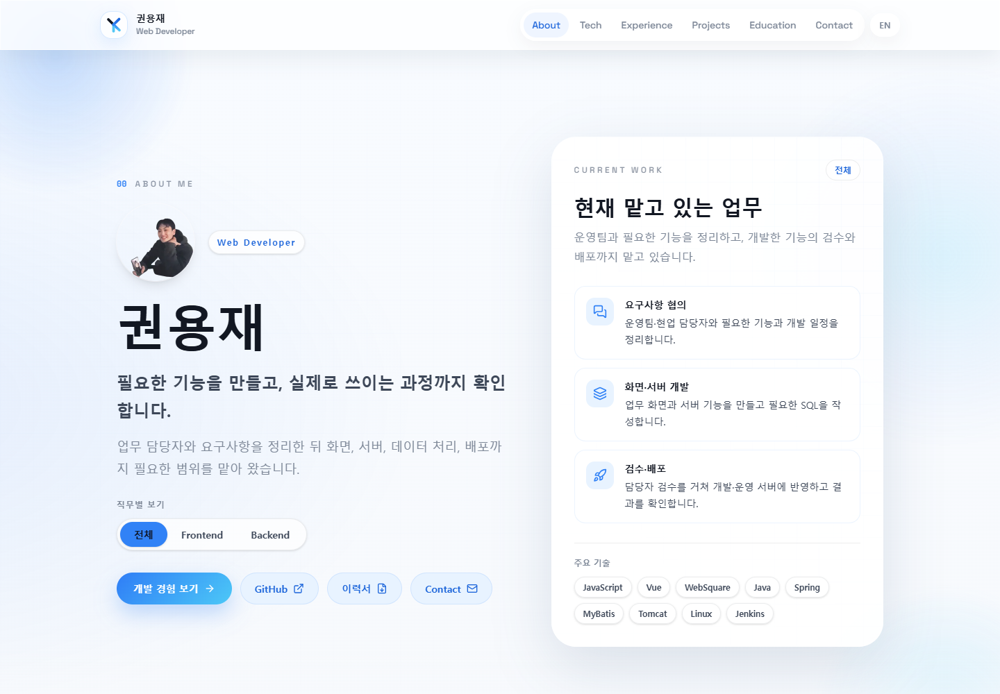

# 권용재 · 웹 개발자 포트폴리오

실무 개발 경험과 개인·팀 프로젝트를 소개하는 Vue 3 · TypeScript 사이트입니다.

**[사이트 열기 ↗](https://www.yongjaekwon.com/)** · [프론트엔드 이력서](https://www.yongjaekwon.com/resume.pdf) · [백엔드 이력서](https://www.yongjaekwon.com/resume-backend.pdf)

[](https://www.yongjaekwon.com/)

## 둘러보기

프론트엔드·백엔드 보기를 선택하면 각 영역에서 맡은 일을 볼 수 있습니다. 프로젝트를 열면 문제와 제약, 구현 과정과 결과가 이어집니다.

- **[PPS · 협력사 포털](docs/case-studies/pps.md)** — 대량 파일 압축을 비동기 작업으로 분리해 새로고침 후에도 진행 상태를 확인하게 했습니다. [Vue 화면 간 공유 상태 문제](docs/case-studies/pps.md#2-vue-화면-사이에-남던-공통-상태-분리)를 수정한 과정도 담았습니다.
- **[TSMS · 단말 운영 시스템](docs/case-studies/tsms.md)** — 외부 API 호출 공통화, 등록 전 단말 검증, 현장 점검과 재점검 이력을 연결한 사례입니다.
- **[인터랙티브 데모](https://www.yongjaekwon.com/#projects)** — 예매, API 명세 작성, 그림 학습, 스터디룸 참여 흐름을 직접 조작할 수 있습니다.

실무 사례에는 사내 코드·화면·고객 데이터를 제외한 설명과 축약 코드만 담았습니다. 사이트의 데모는 외부 서버·DB에 연결하지 않는 샘플 시뮬레이션이며, 성능 수치·동시 요청·AI 판정·채팅 결과도 재구성한 예시입니다.

## 코드 살펴보기

소개 내용과 상세 사례는 [프로젝트 데이터](src/data/portfolio.ko.ts)와 [사례 데이터](src/data/caseStudies.ko.ts)로 분리했습니다. 한국어·영어와 직무별 내용을 같은 화면 컴포넌트로 보여줍니다.

| 살펴볼 부분 | 코드 · 테스트 |
| --- | --- |
| 상세 모달을 닫을 때 포커스와 배경 상태 복원 | [모달](src/components/ProjectDetailModal.vue) · [테스트](tests/accessibilityContracts.test.ts) |
| 필요할 때 데모를 불러오고 종료 시 타이머 정리 | [데모 패널](src/components/demos/ProjectDemoPanel.vue) · [개별 구현](src/components/demos) · [테스트](tests/projectDemos.test.ts) |
| 연속 메뉴 이동 시 이전 예약 취소 | [섹션 이동](src/utils/sectionNavigation.ts) · [테스트](tests/sectionNavigation.test.ts) |
| 스크롤 처리에서 프레임당 최신 값 반영 | [스케줄러](src/utils/frameScheduler.ts) · [테스트](tests/frameScheduler.test.ts) |

## 프로젝트 원본

사이트에 소개한 프로젝트의 구현과 테스트는 각 저장소에서 볼 수 있습니다.

- **[ticket-rush](https://github.com/YongjaeKwon/ticket-rush)** — 개인 예매 시스템. 좌석 선점과 예약 확정, 동시 요청·홀드 만료·중복 확정 테스트.
- **[데이터 검증·조회 데모](https://github.com/YongjaeKwon/quant-lab)** — 개인 프로젝트. 합성 데이터 저장·검증·조회, 재실행 정합성과 오류 처리.
- **[SSAFAST](https://github.com/SSAFAST/ssafast)** — 팀 프로젝트에서 동적 API 명세 입력 폼과 테스트 결과 화면 담당.
- **[ddoing](https://github.com/GomGom-Team/ddoing)** — 팀 프로젝트에서 Canvas 그림 학습 화면, 타이머와 판정 서버 연동 담당.
- **[MODAC](https://github.com/YongjaeKwon/MODAC)** — 팀 프로젝트에서 스터디룸 입장, 학습 기록과 채팅 UI 담당.

## 실행

Node.js 20.9 이상과 npm이 필요합니다.

```bash
npm ci
npm run dev
```

`npm test`로 이 포트폴리오의 로직과 UI·콘텐츠 관련 검사를 실행합니다. 전체 브라우저 흐름이나 다른 프로젝트를 검증하는 테스트는 아닙니다. `npm run build`는 타입 검사와 정적 빌드를 수행하고, `npm run preview`로 빌드 결과를 확인할 수 있습니다.
