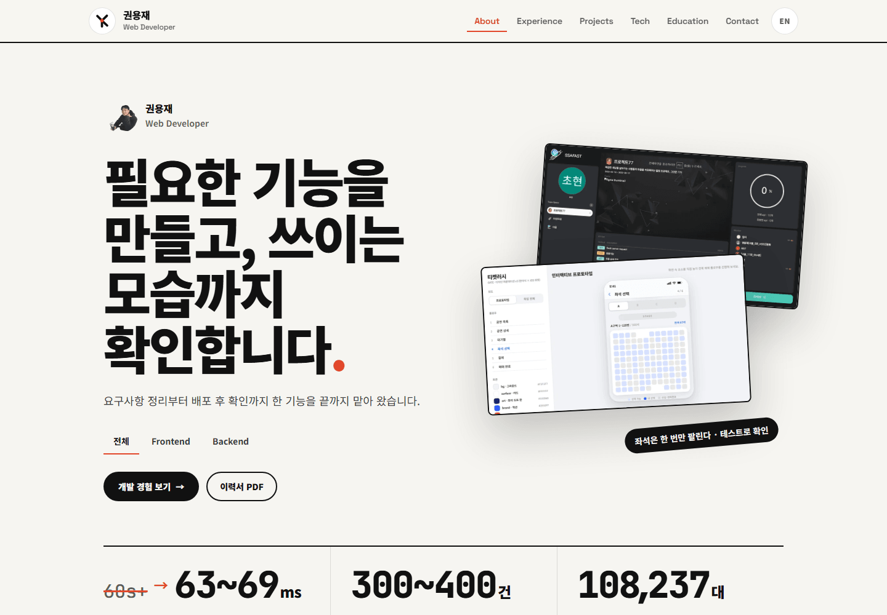

# 권용재 · 웹 개발자 포트폴리오

운영 중인 공공 · B2B 업무 시스템을 만드는 웹 개발자 권용재의 포트폴리오 사이트입니다. Vue 3와 TypeScript로 만들었습니다.

**[사이트 열기 ↗](https://www.yongjaekwon.com/)** · [포트폴리오 PDF](https://www.yongjaekwon.com/portfolio.pdf) · [프론트엔드 이력서](https://www.yongjaekwon.com/resume.pdf) · [백엔드 이력서](https://www.yongjaekwon.com/resume-backend.pdf)

[](https://www.yongjaekwon.com/)

## 대표 성과

| 성과 | 프로젝트 |
| --- | --- |
| 60초 안에 끝나지 않던 조회를 **63~69ms**로 줄임 | 교육용 단말 운영 시스템(TSMS) |
| 첨부파일 **300~400건** 압축을 진행 상태가 보이는 작업으로 바꿈 | B2B 협력사 포털(PPS) |
| 교육용 단말 **108,237대**에 QR 발급 (전체 111,593대 중) | 교육용 단말 운영 시스템(TSMS) |

## 둘러보기

전체 · 프론트엔드 · 백엔드 중 하나를 고르면 그 영역에서 맡은 일 위주로 보입니다. 프로젝트를 열면 문제, 제약, 판단, 구현, 결과 순서로 이어집니다.

- **[PPS · 협력사 포털](docs/case-studies/pps.md)**: 대량 첨부파일 압축을 별도 작업으로 떼어 내 새로고침 후에도 진행 상태를 이어서 보게 했습니다. [Vue 화면 사이에 남던 상태로 첨부파일이 잘못 연결될 수 있던 문제](docs/case-studies/pps.md#2-vue-화면-사이에-남던-공통-상태-분리)를 화면과 서버 양쪽에서 막은 과정도 담았습니다.
- **[TSMS · 단말 운영 시스템](docs/case-studies/tsms.md)**: 통합 뷰 조회 재작성, 외부 API 호출 공통화, 등록 전 단말 검증, 현장 점검과 재점검 이력 관리 사례입니다.
- **[인터랙티브 데모](https://www.yongjaekwon.com/#projects)**: 예매, API 명세 작성, 그림 학습, 스터디룸 참여 흐름을 직접 눌러 볼 수 있습니다.

실무 사례에는 사내 코드 · 화면 · 고객 데이터를 빼고 설명과 축약한 코드만 담았습니다. 사이트의 데모는 외부 서버나 DB에 연결하지 않는 샘플 시뮬레이션이라, 성능 수치 · 동시 요청 · AI 판정 · 채팅 결과도 재구성한 예시입니다.

URL을 넣을 수 없는 지원서에는 [포트폴리오 PDF](https://www.yongjaekwon.com/portfolio.pdf)(가로 11장)를 첨부합니다. 사이트와 같은 데이터에서 옮겼습니다.

## 프로젝트 원본

사이트에 소개한 프로젝트의 구현과 테스트는 각 저장소에서 볼 수 있습니다.

- **[ticket-rush](https://github.com/YongjaeKwon/ticket-rush)**: 개인 선착순 예매 시스템입니다. 좌석 선점과 예약 확정, 동시 요청과 선점 만료, 중복 확정 방지를 테스트로 확인합니다. Next.js 웹을 붙인 2단계를 마쳤고, Outbox 이벤트를 Kafka로 넘기는 3단계를 진행하고 있습니다.
- **오늘사이**: 오프라인 소개팅 운영 서비스로, 비공개 개인 프로젝트라 저장소 링크가 없습니다. 서비스 구조와 동시 신청 결과는 사이트와 PDF에 적었습니다.
- **[ReachRich 공개 데모(quant-lab)](https://github.com/YongjaeKwon/quant-lab)**: 비공개 개인 프로젝트 ReachRich의 저장 · 검증 · 조회 흐름을 합성 데이터로 옮긴 공개 데모입니다.
- **[SSAFAST](https://github.com/SSAFAST/ssafast)**: 팀 프로젝트에서 동적 API 명세 입력 폼과 테스트 결과 화면을 맡았습니다.
- **[ddoing](https://github.com/GomGom-Team/ddoing)**: 팀 프로젝트에서 Canvas 그림 학습 화면, 타이머, 판정 서버 연동을 맡았습니다.
- **[MODAC](https://github.com/YongjaeKwon/MODAC)**: 팀 프로젝트에서 스터디룸 입장, 학습 기록, 채팅 UI를 맡았습니다.

## 코드 살펴보기

소개 내용과 상세 사례는 [프로젝트 데이터](src/data/portfolio.ko.ts)와 [사례 데이터](src/data/caseStudies.ko.ts)에 따로 두고, 한국어 · 영어와 직무별 내용을 같은 화면 컴포넌트로 보여 줍니다. 영어 데이터는 영어 페이지를 열 때만 불러옵니다.

| 살펴볼 부분 | 코드 · 테스트 |
| --- | --- |
| 상세 모달을 닫을 때 포커스와 배경 상태 복원 | [모달](src/components/ProjectDetailModal.vue) · [테스트](tests/accessibilityContracts.test.ts) |
| 필요할 때 데모를 불러오고 종료 시 타이머 정리 | [데모 패널](src/components/demos/ProjectDemoPanel.vue) · [개별 구현](src/components/demos) · [테스트](tests/projectDemos.test.ts) |
| 연속 메뉴 이동 시 이전 예약 취소, 동작 줄이기 설정 존중 | [섹션 이동](src/utils/sectionNavigation.ts) · [테스트](tests/sectionNavigation.test.ts) |
| 스크롤 상태를 한 곳에서 계산해 메뉴와 버튼이 함께 사용 | [스크롤 상태](src/composables/useScrollMetrics.ts) · [계산](src/utils/scrollMetrics.ts) · [테스트](tests/scrollMetrics.test.ts) |
| 포트폴리오 PDF 생성 | [슬라이드 원본](docs/portfolio-deck.html) · [스크립트](scripts/generate-portfolio-pdf.mjs) · [Chrome 인쇄 공용 모듈](scripts/chrome-pdf.mjs) |

디자인 기준(색 · 글꼴 · 선 · 터치 규칙)은 [docs/ui-kit.md](docs/ui-kit.md)에 정리했습니다.

## 실행

Node.js 22 이상과 npm이 필요합니다.

```bash
npm ci
npm run dev
```

| 명령 | 하는 일 |
| --- | --- |
| `npm test` | 이 포트폴리오의 로직 · 접근성 · 콘텐츠 계약 검사 (다른 프로젝트나 전체 브라우저 흐름은 검증하지 않음) |
| `npm run build` | 타입 검사와 정적 빌드. `npm run preview`로 결과 확인 |
| `npm run portfolio:pdf` | `docs/portfolio-deck.html`을 `public/portfolio.pdf`로 인쇄 (Chrome 또는 Edge 필요) |
| `npm run resumes:pdf` | 이력서 HTML을 `public/resume*.pdf`로 인쇄 |
